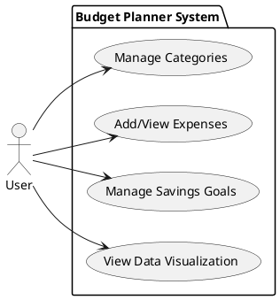
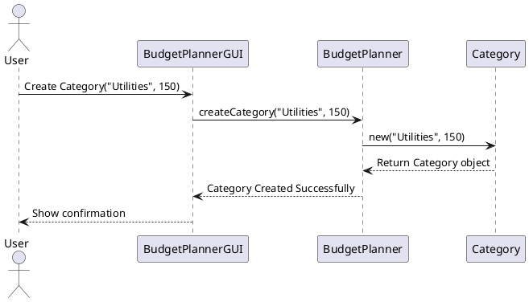
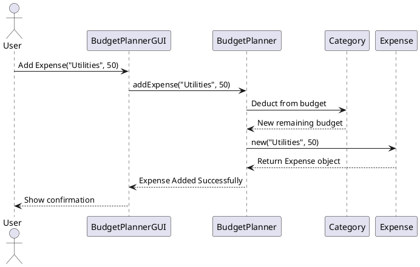
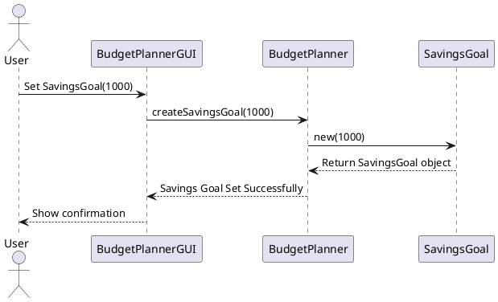
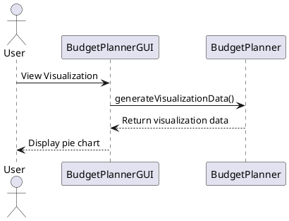
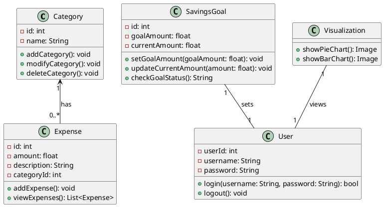

# System Analysis

By James Galbraith and Ahmed Khan

Github Link: https://github.com/ajgalbraith/oop-final-project

## Project Description

### General Description, Goals, and Benefits

**Budget Planner** is a desktop application designed to help users plan and manage their finances. With the ability to
create categories for budgeting, track expenses, set savings goals, and visualize the distribution of budget
allocations, the application aims to promote smart money management.

**Goals:**

- Facilitate tracking of income and expenses.
- Offer visual representation of financial data for better insights.
- Help users set and achieve savings goals.

**Benefits:**

- Users can quickly analyze their spending habits.
- Visual aids help with quick decision-making.
- Setting and tracking savings goals can encourage fiscal responsibility.

### System input(s) and output(s)

**Input(s):**

- Budget categories and their respective limits.
- Expenses along with their category and amount.
- Savings goals with target amounts.

**Output(s):**

- List of categories and their remaining budgets.
- List of all expenses by category.
- Progress towards set savings goals.
- Visual representations (like pie charts) of budget allocations.

### Special requirements

- **Performance**: The application should be responsive and provide visualizations in real-time.
- **Interfaces**: Simple GUI interface using Tkinter.
- **Constraints**: Limited to desktop platforms, data persistence using Pickle.
- **Reliability**: Since data persistence is achieved using Pickle, there's a dependency on ensuring the file system's
  integrity.

## Uses Cases Diagram(s) and Use Cases Description

---

#### **Use Case Diagram:**

--- 

#### **UC-1: Manage Categories**

- **UC Reference Name/Number:** UC1
- **Overview:** Allows the user to add, modify, or delete categories for budgeting.
- **Related use cases:** None
- **Actors:** User
- **Pre Conditions:** None
- **Post Conditions:** A category is added, modified, or deleted.

---

#### **UC-2: Add/View Expenses**

- **UC Reference Name/Number:** UC2
- **Overview:** Allows the user to add an expense to a specific category and view all expenses.
- **Related use cases:** UC1 (because expenses are related to categories)
- **Actors:** User
- **Pre Conditions:** A category must exist to add an expense.
- **Post Conditions:** An expense is added, and the remaining budget for the category is updated.

---

#### **UC-3: Manage Savings Goals**

- **UC Reference Name/Number:** UC3
- **Overview:** Enables the user to set or update a savings goal.
- **Related use cases:** None
- **Actors:** User
- **Pre Conditions:** None
- **Post Conditions:** Savings goal is set or updated.

---

#### **UC-4: View Data Visualization**

- **UC Reference Name/Number:** UC4
- **Overview:** User can view a visual representation (e.g., pie chart) of their budget and expenses.
- **Related use cases:** UC1, UC2
- **Actors:** User
- **Pre Conditions:** There should be some budget or expense data for visualization.
- **Post Conditions:** A visualization of the user's financial data is displayed.

---

### Use Case Description Table:

| UC Reference Number | Overview                | Related use cases        | Actors | Pre Conditions                       | Post Conditions                                      |
|---------------------|-------------------------|--------------------------|--------|--------------------------------------|------------------------------------------------------|
| UC-1                | Manage Categories       | UC-2 (Add Expense)       | User   | Application is running               | Categories are displayed/added/updated in the system |
| UC-2                | Add/View Expenses       | UC-1 (Manage Categories) | User   | At least one category exists         | Expenses are added to the system and can be viewed   |
| UC-3                | Manage Savings Goals    | None                     | User   | Application is running               | Savings goals are set/updated in the system          |
| UC-4                | View Data Visualization | None                     | User   | Some financial data is in the system | Displays pie charts showcasing budget allocations    |

## System Design

### Sequence Diagrams

#### Managing Categories (UC-1):

#### Adding/Viewing Expenses (UC-2):

#### Managing Savings Goals (UC-3):

#### Viewing Data Visualization (UC-4):

 

---

## System Design

### Class Diagram(s)

Our class diagrams provide a comprehensive view of the system's object-oriented structure, including its classes,
attributes, operations, and the relationships between those classes.

---

#### **Class Diagram for Budget Planner System**:

---

#### Class Descriptions:

1. **Category**: This class represents the different categories of expenses in the budget planner system.

- **Attributes**:
    - `id`: Unique identifier for each category.
    - `name`: Name of the category.
- **Operations**:
    - `addCategory()`: Add a new category.
    - `modifyCategory()`: Modify an existing category.
    - `deleteCategory()`: Delete a category.

2. **Expense**: This class deals with individual expenses added by the user.

- **Attributes**:
    - `id`: Unique identifier for each expense.
    - `amount`: Amount of the expense.
    - `description`: A brief description of the expense.
    - `categoryId`: The ID of the category to which the expense belongs.
- **Operations**:
    - `addExpense()`: Add a new expense.
    - `viewExpenses()`: View all expenses.

3. **SavingsGoal**: This class represents the savings goal set by the user.

- **Attributes**:
    - `id`: Unique identifier for the savings goal.
    - `goalAmount`: The amount the user aims to save.
    - `currentAmount`: The current amount saved towards the goal.
- **Operations**:
    - `setGoalAmount(goalAmount: float)`: Set a new goal amount.
    - `updateCurrentAmount(amount: float)`: Update the current saved amount.
    - `checkGoalStatus()`: Check if the goal has been achieved.

4. **Visualization**: Handles the data visualization part of the budget planner system.

- **Operations**:
    - `showPieChart()`: Display a pie chart representing expenses and savings.
    - `showBarChart()`: Display a bar chart with the same data.

5. **User**: Represents an individual user of the system.

- **Attributes**:
    - `userId`: A unique identifier for each user.
    - `username`: The username chosen by the user.
    - `password`: User's password.
- **Operations**:
    - `login(username: String, password: String)`: Authenticate and login the user.
    - `logout()`: Logout the current user.

Relationships:

- **Category and Expense**: A category can have multiple expenses (one-to-many relationship).
- **User and SavingsGoal**: A user sets a savings goal (one-to-one relationship).
- **User and Visualization**: A user views visualizations (one-to-one relationship).

---

## Conclusion

The Budget Planner application provides a seamless interface for users to manage their finances. Through comprehensive
UML diagrams, the intricacies of the system, from the users' interactions to the underlying data structures, are
depicted clearly. This makes further development, debugging, or modifications simpler and more effective. As with any
software design, understanding the interaction between components is crucial, and the use of UML diagrams aids this
understanding.

